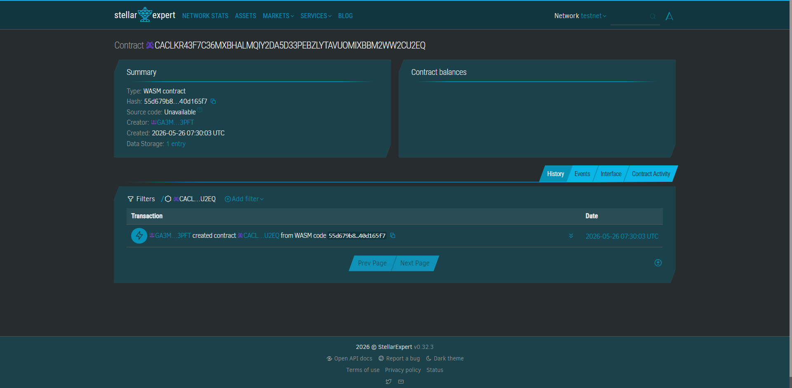

# BayanAid

Disaster relief voucher distribution using Stellar blockchain.

---

## CONTRACT ID:
CACLKR43F7C36MXBHALMQIY2DA5D33PEBZLYTAVUOMIXBBM2WW2CU2EQ

## CONTRACT LINK: 
https://stellar.expert/explorer/testnet/contract/CACLKR43F7C36MXBHALMQIY2DA5D33PEBZLYTAVUOMIXBBM2WW2CU2EQ

 

## Problem

After typhoons in the Philippines, NGOs and barangays struggle to distribute aid transparently because of paper-based records and manual cash handling.

---

## Solution

BayanAid uses Soroban smart contracts to issue digital relief vouchers that victims can claim instantly through QR codes or wallets.

---

## Stellar Features Used

- Soroban Smart Contracts
- Stellar Payments
- Custom Tokens
- Trustlines

---

## Vision and Purpose

To make disaster relief distribution faster, transparent, and secure for Filipino communities affected by typhoons.

---

## Timeline

- Week 1 — Smart contract development
- Week 2 — QR code + wallet integration
- Week 3 — Frontend dashboard
- Week 4 — Testnet deployment

---

## Prerequisites

- Rust
- Soroban CLI
- Stellar testnet account

Recommended:
- soroban-cli 22.x

---

## Build Contract

```bash
soroban contract build
